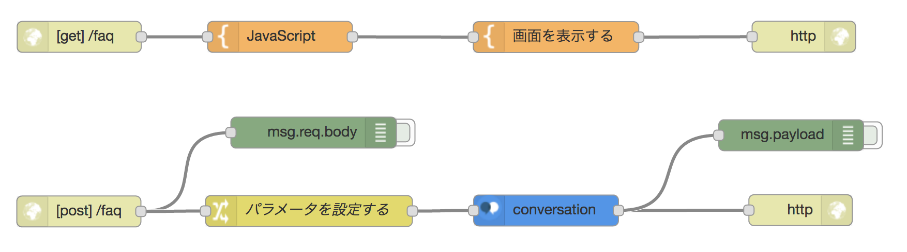

# Node-RED
IBM Bluemix の Node-RED で作成したアプリを保管してます。

## conversation-demo
Watson Conversation の Demo です。フローを以下に示します。

作成手順を以下に示します。
* Conversation
  - Tool で workspace-diet.json をインポートしてください
* Node-RED flow editor
  - flow.json をインポートしてください。
  - conversation function に Username (*1)、Password (*1)、Workspace IDを設定してください。

> *1 アプリと Conversation サービスをバインドしている場合は不要です。
    
## 参考資料
* Qiita: 目からウロコ！Node-REDのデザインパターン10選
  - http://qiita.com/zuhito/items/e9abfd6f1ba188f908ed
